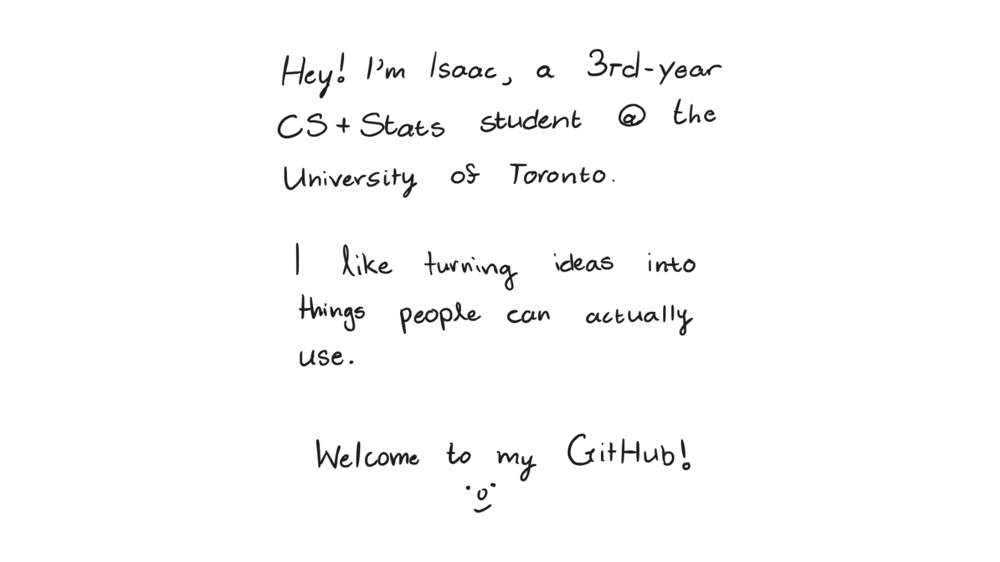

<picture>
  <source
    media="(prefers-color-scheme: dark)"
    srcset="./github-readme-drawing-darkmode.png"
  >
  <source
    media="(prefers-color-scheme: light)"
    srcset="./github-readme-drawing-lightmode.png"
  >
  
</picture>
